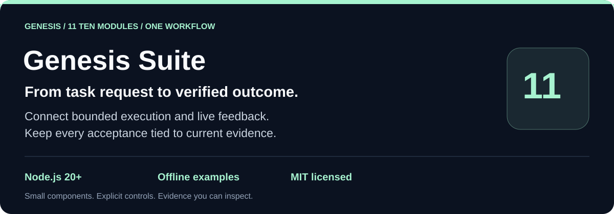
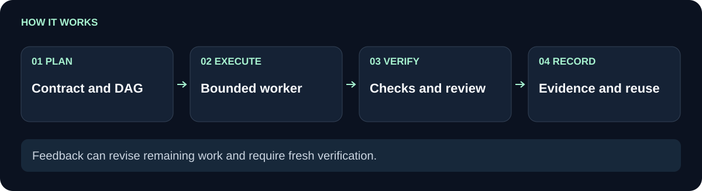

# Genesis Suite

Connect planning, bounded workers, live task adaptation and review evidence in one portable toolkit.

**Dependency-aware execution · Fresh evidence for acceptance · Explicit resource limits**

[Why use it](#why-use-it) · [Quickstart](#try-it-in-five-minutes) · [Choose a component](#ten-focused-systems-one-connected-suite) · [Prompt foundations](modules/genesis-prompt-kit/docs/FOUNDATIONS.md) · [Boundaries](#boundaries)

[](https://nodejs.org/)
[](LICENSE)
[](examples/demo.cjs)

Genesis separates a task's original acceptance contract from its evolving implementation. Workers can propose changes during execution. Checks and independent review bind acceptance to the exact artifact bytes. Feedback creates reusable candidates; measured benchmarks decide whether a public role instruction should be promoted.

This repository contains all ten component packages, plus an integrated runner. A fresh clone runs without installing dependencies, configuring a model or starting a service.

## Why use it

An agent returns a file and says the task is complete. Then feedback changes that file, a dependency is rebuilt, or the reviewer returns only half a result. A plain success flag cannot explain whether the current output still qualifies. Genesis keeps the original task criteria separate from changing artifacts and requires current evidence at acceptance.

Use the suite when your application needs several of these controls together: dependent tasks, bounded worker calls, feedback during execution and inspectable completion evidence. It is intended for developers integrating agent workflows, not a hosted agent service. If you only need a dependency graph or a prompt template, choose the standalone component below. A small script with one deterministic operation may not need this machinery.

| Baseline workflow | Genesis behavior | Practical benefit |
| --- | --- | --- |
| Save a worker's `done` flag | Require checks and review bound to current artifacts | Trace why an output was accepted |
| Retry with a fresh timeout each time | Share a bounded deadline across attempts | Keep failure recovery within a declared budget |
| Edit requirements in the middle of a run | Record accepted revisions and require fresh checks | Preserve the original standard while adapting |
| Copy a prior solution as already approved | Retrieve a source-backed candidate and test its applicability | Reuse without inventing target success or user approval |
| Promote instructions because one example looks good | Stage a charter and require paired evidence with a holdout | Make changes reviewable and reversible |

These are comparisons with the explicitly described baseline behaviors, not benchmark results against other frameworks. The modules make workflow conditions inspectable; they do not guarantee better model output.

## Try it in five minutes

```sh
git clone https://github.com/Wassimyounes01/genesis-suite.git
cd genesis-suite
npm test
npm run demo
```

The demo uses an explicitly labeled offline worker and deterministic review fixture. It creates and removes a temporary workspace, shows a dependency plan, produces an artifact, checks and reviews it, records an outcome, retrieves a reusable attribute, and stages a candidate charter. Its output is a software demonstration, not evidence of a model's intelligence or cost savings.

## How the pieces connect

<picture>
  <source media="(max-width: 600px)" srcset="docs/flow-compact.svg">
  
</picture>

The primary path has four stages. **Prompt Kit and Plan Graph** define the work; **Worker Router** dispatches it; application checkers and **Review Gate** examine it; **Task Ledger** records qualifying evidence. **Task Adaptation** can reopen affected work when accepted feedback changes the path. The integrated runner currently executes one task at a time; the planning graph is not a claim of parallel suite execution.

The supporting paths are explicit: **Repo Atlas** helps locate sources; **Context Graph** retrieves reusable candidates; **Night Research** runs a separately invoked bounded pass; **Charter Lab** evaluates public instruction changes. A research finding does not automatically promote a charter. No background graph watcher or model-weight training runs on import.

## Ten focused systems, one connected suite

| Component | What it enables |
| --- | --- |
| [Task Ledger](https://github.com/Wassimyounes01/genesis-task-ledger) | Immutable task criteria, current artifact hashes, bound review and duplicate-credit prevention. |
| [Plan Graph](https://github.com/Wassimyounes01/genesis-plan-graph) | Dependency readiness and declared file ownership within actual worker capacity. |
| [Task Adaptation](https://github.com/Wassimyounes01/genesis-task-adaptation) | During-task feedback, coordinator decisions and persistent recheck requirements. |
| [Context Graph](https://github.com/Wassimyounes01/genesis-context-graph) | Searchable attributes, explicit provenance and candidate connections. |
| [Worker Router](https://github.com/Wassimyounes01/genesis-worker-router) | Shared deadlines, finite attempts, account-aware fallback and bounded CLI workers. |
| [Night Research](https://github.com/Wassimyounes01/genesis-night-research) | One scheduled pass with time-window, pause, gaming and source budgets. |
| [Repo Atlas](https://github.com/Wassimyounes01/genesis-repo-atlas) | A bounded metadata census of explicitly supplied roots and provenance pointers. |
| [Review Gate](https://github.com/Wassimyounes01/genesis-review-gate) | Strict finder/refuter results that preserve unresolved or incomplete reviews. |
| [Charter Lab](https://github.com/Wassimyounes01/genesis-charter-lab) | Staged public instructions, paired evaluation, held-out checks and rollback. |
| [Prompt Kit](https://github.com/Wassimyounes01/genesis-prompt-kit) | Original Genesis operating prompts, role contracts and teaching examples. |

Standalone repositories have their own examples and tests. The `modules/` directory vendors the same release so the integrated checkout works offline. [The module lock](modules-lock.json) records source hashes; no Git submodule setup is required.

## Practical uses

- **A code change across several packages.** Declare ownership and dependencies, delegate bounded packets, then require regression evidence and an independent reviewer before accepting each output.
- **An existing design worth reusing.** Register the actual artifact and its applicable attributes, retrieve a candidate connection, and test it in the new context. Passing tests never invents user preference or approval.
- **An overnight research assistant.** Invoke one pass from your scheduler, supply explicit pause and activity checks, and leave findings as unverified candidates until sources and proposed improvements are evaluated.

## Integrate a real worker

For a concrete failure example, run the [integration tests](test/integration.test.cjs). They change an artifact after checking it, introduce feedback during review and attempt a child task with stale parent evidence. Acceptance fails or the task becomes ineligible until fresh evidence exists. The successful offline path and these counterexamples explain the difference between producing an artifact and accepting its current version.

See [the runner API](docs/API.md) and [the complete offline example](examples/demo.cjs). Providers, checkers and reviewers are injected by your application. The supplied session CLI adapter accepts an explicit executable and arguments; it does not guess an installed binary, purchase overage or select a hidden fallback.

For Cursor Auto, configure the authenticated CLI installed on your machine and its documented read-only invocation. Provider versions and interfaces can differ. The generic adapter is available in `modules/genesis-worker-router`; verify your CLI command before connecting it to an automated task. The hosted desktop agent's own planner/model settings remain outside this library.

## Quality, feedback and cost

The prompting foundation was informed in part by analysis of a supplied collection labeled as system-prompt leaks, followed by original templates and runtime controls. The labels are unverified and the collection is not shipped. Read the [foundation and pattern-to-code mapping](modules/genesis-prompt-kit/docs/FOUNDATIONS.md), the [reusable repository-design prompt](modules/genesis-prompt-kit/docs/REPOSITORY-DESIGN-PROMPT.md), and the [eleven-repository design trial](modules/genesis-prompt-kit/docs/DESIGN-TRIAL.md).

A planner/reviewer profile is configuration, not a quality guarantee. An expensive model can still fail; a cheaper one can pass a carefully scoped task. Capture actual provider identity and usage when reported, include retries and review overhead in comparisons, and keep unknown costs unknown.

The reward is a recorded workflow outcome. It does not simulate dopamine, change neural network weights or establish recursive reinforcement learning. Charter promotion changes versioned public text only. The library cannot authenticate a caller's claimed reviewer identity, prove a holdout was unseen, or make an arbitrary callback obey a sandbox.

## Boundaries

Imports start no workers, timers or network requests. Constructors may initialize only the explicitly supplied state directories. External communication, deployment and purchases require authority from the host application. The suite does not include an email transport, outreach engine, user memory, account credentials, private prompt collection or local inference model.

Use one writer per state directory unless an external lock is provided. Declare and enforce real process permissions outside this library. Resource limits bound the orchestrator's dispatch; an injected callback must honor cancellation, and a hung noncooperative callback may retain capacity until it settles.

## Verification and contribution

`npm test` runs each vendored component suite and the integration failures sequentially. `npm run demo` executes the offline flow. CI repeats both on Windows and Linux with Node.js 20 and 22. See [verification](VERIFICATION.md), [contribution guidance](CONTRIBUTING.md), and [trust boundaries](SECURITY.md).
