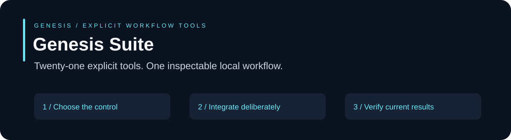
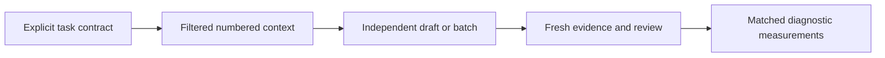

# Genesis Suite

Twenty-one component APIs for explicit, bounded workflows. This release extends the original sixteen components with five draft and measurement controls; it does not change the integrated runner's authority or worker routing automatically.

**CommonJS · Built-in modules only · Node.js 22.23.2 / 24.14.0 · MIT**

```sh
npm test
npm run demo
node examples/efficiency-controls.cjs
npm run verify
```

```js
const { createGenesis, modules } = require('./');
const candidate = modules.constraintCompiler.compileConstraints({taskType:'source-review',effects:['source-read']});
```

## Five additional controls

| API | Use case |
| --- | --- |
| [`modules.taskContext`](modules/genesis-task-context) | Bounded source reviews, isolated workers and precise code investigation. |
| [`modules.constraintCompiler`](modules/genesis-constraint-compiler) | Teaching a worker a narrow invariant and its counterexample before a review. |
| [`modules.verifiedReuse`](modules/genesis-verified-reuse) | Avoiding repeated read-only draft work when contracts and source bytes match. |
| [`modules.pairedExperiments`](modules/genesis-paired-experiments) | Preregistered baseline/candidate diagnostics with held-out cases and explicit rubrics. |
| [`modules.batchDrafts`](modules/genesis-batch-drafts) | Two to four static source-review drafts on the same declared worker configuration. |



## Component inventory

- [genesis-task-ledger](modules/genesis-task-ledger)
- [genesis-plan-graph](modules/genesis-plan-graph)
- [genesis-task-adaptation](modules/genesis-task-adaptation)
- [genesis-context-graph](modules/genesis-context-graph)
- [genesis-worker-router](modules/genesis-worker-router)
- [genesis-night-research](modules/genesis-night-research)
- [genesis-repo-atlas](modules/genesis-repo-atlas)
- [genesis-review-gate](modules/genesis-review-gate)
- [genesis-charter-lab](modules/genesis-charter-lab)
- [genesis-prompt-kit](modules/genesis-prompt-kit)
- [genesis-source-packets](modules/genesis-source-packets)
- [genesis-evidence-collector](modules/genesis-evidence-collector)
- [genesis-regression-memory](modules/genesis-regression-memory)
- [genesis-routing-metrics](modules/genesis-routing-metrics)
- [genesis-change-impact](modules/genesis-change-impact)
- [genesis-release-integrity](modules/genesis-release-integrity)
- [genesis-task-context](modules/genesis-task-context)
- [genesis-constraint-compiler](modules/genesis-constraint-compiler)
- [genesis-verified-reuse](modules/genesis-verified-reuse)
- [genesis-paired-experiments](modules/genesis-paired-experiments)
- [genesis-batch-drafts](modules/genesis-batch-drafts)

The [task workflow](GENESIS.md) explains proportional planning, focused context, draft reuse, batching and measured adaptation. The [API guide](docs/API.md) documents the integrated runner and all five additional API interfaces. These additions remain explicit host integrations. [modules-lock.json](modules-lock.json) binds all twenty-one component inventories; [FILES.json](FILES.json) binds this complete release. [Verification](VERIFICATION.md) records the release heads, local counts and completed CI scope.

## Limits

Synthetic demos and regression fixtures do not establish doubled quality or a general token/cost reduction. Preserve unknown usage, failed attempts, stale artifacts and required independent review. Source filtering is heuristic; caller-owned trees and trusted records remain necessary. No network publication, provider execution, model-weight training or automatic promotion occurs when importing these modules.

Reuse under the [MIT license](LICENSE). All included files are locally reviewable. Integrate only the controls that fit your task.
