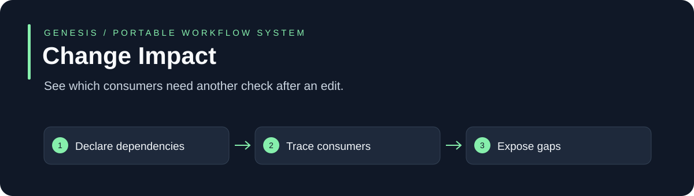

# Change Impact

See which consumers need another check after an edit.

**Node.js 20+ · Built-in modules only · MIT · No daemon or model account required**

[Why use it](#why-use-it) · [Quickstart](#quickstart) · [API and examples](#api-and-examples) · [Limits](#limits)

## Why use it

One source file feeds tests, documentation and downloadable products. Traverse an explicit reverse dependency map before declaring completion.

Use it for: **Shared library changes, API documentation and downloadable release maintenance.**

| A common starting point | This system adds | Why that helps |
| --- | --- | --- |
| Implicit assumptions and scattered state | An explicit, bounded input contract | You can inspect what was actually considered |
| A success flag | A structured result with gaps and failure cases | Missing evidence remains visible |
| A one-time example | Runnable positive and negative fixtures | You can test the behavior before adopting it |

This is a small library you integrate into your application. It is useful when this particular control is missing; it does not replace your existing agent, CI or business policy. These are design differences, not benchmark claims of superiority.

## Quickstart

```sh
git clone https://github.com/your-organization/genesis-change-impact.git
cd genesis-change-impact
npm test
npm run demo
```

No dependency installation is needed. Tests use temporary synthetic data and do not contact customers, charge payments or call model providers.

## API and examples

Exports: **analyzeChangeImpact**. See [the implementation](index.cjs), [runnable demo](examples/demo.cjs) and [complete input fixtures](test/index.test.cjs).

```js
const {analyzeChangeImpact}=require('..');
const manifest={schemaVersion:1,entries:[{path:'lib/core.cjs',kind:'file',dependsOn:[]},{path:'test/core.test.cjs',kind:'test',dependsOn:['lib/core.cjs']},{path:'docs/api.md',kind:'doc',dependsOn:['lib/core.cjs']}]};
console.log(JSON.stringify(analyzeChangeImpact(manifest,['lib/core.cjs']),null,2));
```

The tests document valid contracts, stale evidence, missing fields and failure behavior. Synthetic fixtures demonstrate mechanics; their values are not measured product-performance results. Use only authorized inputs in a real workflow.

## How it connects

1. **Declare dependencies.**
2. **Trace consumers.**
3. **Expose gaps.**

Use this module independently or find it in the [Genesis Suite](https://github.com/your-organization/genesis-suite). The suite connects planning, bounded workers, adaptation and evidence. Operational orchestration remains the responsibility of the host application.

## Limits

Only declared dependencies are covered. Unmapped changes and stale evidence are gaps, not inferred green checks.

Workflow memory and recorded lessons do not train model weights. No claim of doubled quality or 59–90% cost savings has been established by these fixtures. Paired accepted-task measurements are required before making a savings claim.

## Verification and contribution

Run `npm test` before proposing changes. Include a reproducer for a defect and preserve negative tests. GitHub Actions runs the same suite on Linux and Windows. The [MIT license](LICENSE) permits reuse and white-label adaptation; keep its copyright notice.
