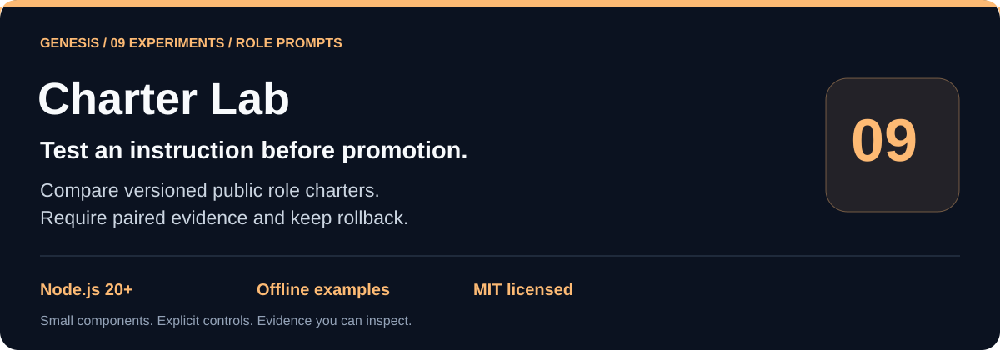
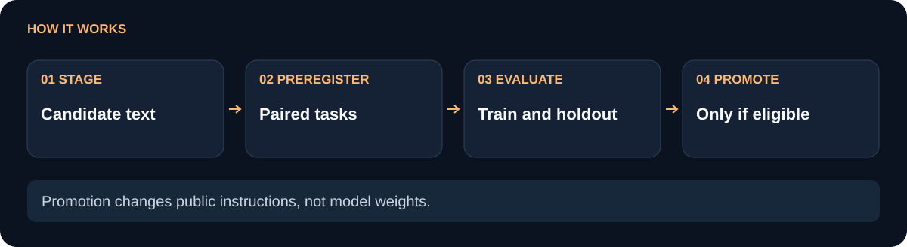

# Genesis Charter Lab

Give public planner and worker role text a measured, reversible lifecycle: stage and hash a candidate, preregister paired benchmarks, record verifier-checked evidence, promote only when the frozen rules are met, and roll back with a reason when needed.

**Hash-bound candidates.** **Preregistered train and holdout evidence.** **Reversible promotion.**

[Problem and fit](#problem-and-fit) · [Workflow](#workflow) · [Quickstart](#quickstart) · [API](#api) · [Limits](#limits-and-boundaries) · [Verification](#verification) · [Related projects](#related-projects)

[](https://nodejs.org/) [](LICENSE)

<picture>
  <source media="(max-width: 600px)" srcset="docs/flow-compact.svg">
  
</picture>

## Problem and fit

Changing planner or worker instructions changes a workflow, but a promising result can be hard to reproduce or undo. A score written after the fact can also hide which baseline, task, artifact, or text version was measured. Charter Lab stores those bindings in caller-owned JSON and makes promotion depend on explicit evidence.

Use it to compare a candidate planner charter, evaluate a worker handoff rule, or keep a public history of role text versions. It measures workflow outcomes supplied by the caller. It does not train model weights, change evaluator rules, or grant the candidate host authority.

**Illustrative scenario:** a shorter worker brief appears useful on one task. Instead of replacing the active charter immediately, a maintainer stages it, preregisters paired tasks and records separate holdout evidence. Promotion remains ineligible if the required evidence or measured benefit is missing.

**Use simpler code when** you only need to version a prompt in Git and are not running comparative experiments. This module adds evidence bookkeeping, not an automatic evaluator.

## Workflow

The diagram maps the lifecycle. `stage` trims role text and derives a SHA-256 candidate hash against the current active baseline. `preregister` fixes `quality` or `tokens`, a minimum relative gain, a task ID, and `train` or `holdout`. `recordEvidence` checks the digest, timestamps, artifact binding, and injected verifier. `promote` requires three distinct training tasks and one separate holdout with measured benefit and zero regressions; `rollback` moves a role back to a prior promoted version or its baseline.

| Baseline | This component |
| --- | --- |
| Role text can be replaced without a durable version binding. | Candidate text, role, baseline, and version are tied to a SHA-256 hash. |
| Benchmarks can be selected or scored after seeing a result. | Task IDs, split, metric, and minimum gain are preregistered before evidence. |
| A score can be accepted without proving which artifact was measured. | Evidence binds candidate/baseline/task/split to artifact ID, current hash, digest, and timestamp. |
| A successful experiment may become a one-way configuration change. | Promotion is explicit, history is retained, and `rollback` accepts a prior promoted version or baseline. |

The evaluator rules are public and frozen: allowed metrics are `quality` and `tokens`; promotion needs at least three `train` receipts and one distinct `holdout`; regressions must be zero; and candidates cannot mutate authority or those rules.

## Quickstart

The repository has no runtime dependencies. Node 20 or newer is required.

```sh
git clone https://github.com/Wassimyounes01/genesis-charter-lab.git
cd genesis-charter-lab
npm test
npm run demo
```

`npm test` runs the offline Node test suite. `npm run demo` stages a planner candidate, preregisters three training tasks and one holdout, records fixture evidence through an injected verifier, and prints the promotion receipt. It writes only to a temporary directory and does not call a model.

For one synthetic fixture receipt (the scores and echo verifier below are demonstration data, not a measured experiment):

```js
const { createCharterLab, evidenceDigest } = require('./index.cjs');

const lab = createCharterLab({
  stateDir: './charter-state',
  verifyEvidence: receipt => ({
    ok: true,
    proofDigest: receipt.proofDigest,
    artifactId: receipt.artifactId,
    currentHash: receipt.currentHash,
    independentReview: true,
  }),
});

const candidate = lab.stage({
  role: 'worker',
  text: 'Execute the supplied contract and return evidence.',
  rationale: 'Make handoffs explicit.',
});
lab.preregister({
  candidateHash: candidate.hash,
  metric: 'quality',
  minimumRelativeGain: 0.05,
  taskId: 'train-1',
  split: 'train',
});
const fields = {
  candidateHash: candidate.hash,
  baselineHash: candidate.baselineHash,
  taskId: 'train-1',
  split: 'train',
  metric: 'quality',
  minimumRelativeGain: 0.05,
  artifactId: 'artifact-train-1',
  currentHash: candidate.hash,
  measuredAt: new Date().toISOString(),
  baselineScore: 10,
  candidateScore: 11,
  regressions: 0,
};
lab.recordEvidence({ ...fields, proofDigest: evidenceDigest(fields) });
```

The verifier must return matching `proofDigest`, `artifactId`, `currentHash`, and `independentReview: true`. In a real evaluation, that callback should check the actual artifact and review record rather than echoing the fields as the fixture does.

## API

- `createCharterLab({ stateDir, verifyEvidence, evidenceFreshnessMs, now })` returns a state-dir-scoped lab. `verifyEvidence` is required for recording or promotion; `now` is useful for deterministic tests.
- `stage({ role, text, rationale })` accepts the frozen `planner` or `worker` role and returns the candidate with `hash`, `version`, `baselineHash`, and `staged` status.
- `preregister({ candidateHash, metric, minimumRelativeGain, taskId, split })` records a benchmark plan for a staged candidate.
- `recordEvidence(input)` validates preregistration, freshness, paired scores, zero regressions, and `evidenceDigest(input)`, then asks the injected verifier for matching independent proof.
- `promote({ candidateHash })` applies the frozen train/holdout rules and makes the candidate active for its role.
- `rollback({ role, version?, reason })` returns to a prior promoted version or the baseline and retains a history receipt.
- `get(role)` returns the active text and version; `snapshot()` returns the bounded JSON state; `evidenceDigest(input)` computes the binding digest.

Default evidence freshness is 24 hours and may be configured up to 30 days. State limits are 100 candidates, 2,000 preregistrations, 2,000 evidence records, 2,000 history entries, and 1 MiB of JSON. Quality benefit is measured relative to the baseline score; token benefit requires positive baseline and candidate counts with fewer candidate tokens.

## Limits and boundaries

Charter Lab records a workflow protocol; it does not train model weights, run benchmark tasks, inspect artifacts, or determine whether a verifier is truly independent. Without `verifyEvidence`, evidence is rejected. The callback’s return value is checked against the digest and artifact bindings, but the callback’s honesty and access to the real review system remain caller responsibilities.

The state directory and verifier are caller-owned. A prompt or provider callback cannot enforce an OS sandbox, and this package does not provide one. File permissions, concurrent writers, credentials, task selection, metric design, and evaluator authority remain outside the module. Promotion also does not deploy or activate text in a host application; the host must read `get(role)` and decide how to apply it.

## Verification

The tests cover hash-bound staging, preregistration requirements, three-train plus holdout promotion, missing benefit, rollback history, token count validation, exact proof binding, freshness, and role-bound rollback targets. Run `npm test` from the repository root to repeat them; `npm run demo` verifies the full documented promotion path with a disposable fixture.

## Related projects

- [genesis-review-gate](https://github.com/Wassimyounes01/genesis-review-gate) produces strict artifact review receipts.
- [genesis-prompt-kit](https://github.com/Wassimyounes01/genesis-prompt-kit) packages bounded prompt inputs.
- [genesis-suite](https://github.com/Wassimyounes01/genesis-suite) groups the public Genesis components.

See [examples/demo.cjs](examples/demo.cjs), [index.cjs](index.cjs), and [test/charter-lab.test.cjs](test/charter-lab.test.cjs) for the runnable example and executable contract.

