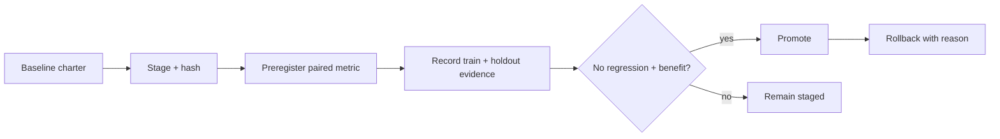

# genesis-charter-lab

[](https://nodejs.org/) [](LICENSE)

`genesis-charter-lab` gives public planner and worker role text a measured lifecycle: stage and hash one candidate, preregister paired benchmarks, require independently verified artifact evidence across training and holdout, then promote or roll back.



## Run locally

```sh
git clone https://github.com/Wassimyounes01/genesis-charter-lab.git
cd genesis-charter-lab
npm test
npm run demo
```

No dependency installation is required. The complete runnable setup is in [examples/demo.cjs](examples/demo.cjs); API snippets illustrate integration shapes.


Use it to evaluate a planning charter, compare a worker handoff rule, or keep a reversible history of public role text. It records workflow feedback and benchmark evidence; it does not train model weights and cannot modify evaluator rules or host authority.

## Five-minute offline quickstart

```sh
npm test
npm run demo
```

```js
const { createCharterLab, evidenceDigest } = require('./index.cjs');
const lab = createCharterLab({ stateDir: './example-state', verifyEvidence: receipt => ({
  ok: true, proofDigest: receipt.proofDigest, artifactId: receipt.artifactId,
  currentHash: receipt.currentHash, independentReview: true,
}) });
const candidate = lab.stage({ role: 'worker', text: 'Return bounded evidence.', rationale: 'Clearer handoff.' });
lab.preregister({ candidateHash: candidate.hash, metric: 'quality', minimumRelativeGain: 0.05, taskId: 'train-1', split: 'train' });
const evidence = { candidateHash: candidate.hash, baselineHash: candidate.baselineHash, taskId: 'train-1', split: 'train', metric: 'quality', minimumRelativeGain: 0.05, artifactId: 'artifact-1', currentHash: candidate.hash, measuredAt: new Date().toISOString(), baselineScore: 10, candidateScore: 11, regressions: 0 };
lab.recordEvidence({ ...evidence, proofDigest: evidenceDigest(evidence) });
```

Promotion requires at least three distinct `train` task receipts and one distinct `holdout` receipt. Every receipt must be linked to a preregistration, bind candidate/baseline/task/split/artifact/current hashes and the computed `evidenceDigest`, include a measurement taken at or after preregistration, pass the injected verifier at record and promotion time, meet its measured quality or token gain, report zero regressions, and remain within the configured freshness window. State is caller-owned JSON with bounded counts and size; callers are responsible for protecting its directory and verifier integrity. Without `verifyEvidence`, no evidence is accepted.

Run `node --test` (or `npm test`). Adjacent projects: [genesis-review-gate](https://github.com/Wassimyounes01/genesis-review-gate), [genesis-prompt-kit](https://github.com/Wassimyounes01/genesis-prompt-kit), and [genesis-suite](https://github.com/Wassimyounes01/genesis-suite).
