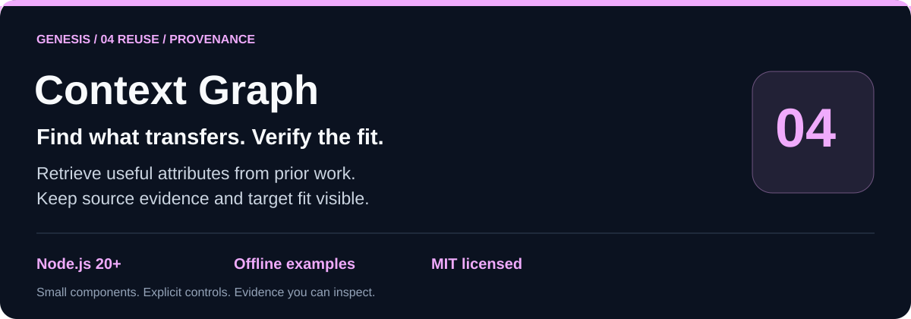
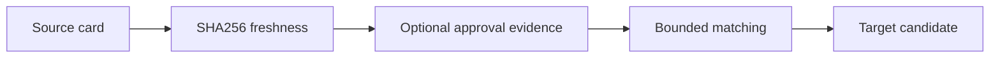

# genesis-context-graph

 

`genesis-context-graph` makes reusable context inspectable: bounded source cards are matched by terms only while their source artifact, optional evaluation evidence, and any supplied user-approval receipt remain current.



## Run locally

```sh
git clone https://github.com/Wassimyounes01/genesis-context-graph.git
cd genesis-context-graph
npm test
npm run demo
```

No dependency installation is required. The complete runnable setup is in [examples/demo.cjs](examples/demo.cjs); API snippets illustrate integration shapes.


Use it for reusable workflow patterns, evidence-backed context retrieval, or a small local provenance view before adapting a mechanism to a new task.

## API and five-minute offline start

```js
const { createContextGraph } = require('./index.cjs');
const graph = createContextGraph({ stateDir: './state', sourceRoot: './sources' });
graph.registerCard({
  id: 'card-1', task: { id: 'task-1', label: 'source task', domain: 'workflow' },
  artifact: { path: 'source.md', sha256: 'sha256-of-source' },
  attributes: [{ id: 'trait-1', label: 'bounded checks', mechanism: 'bind checks to criteria', tags: ['evidence'], appliesTo: ['workflow'], contraindications: [] }],
  approval: { messageRef: 'approval-1', receipt: { path: 'approval.json', sha256: 'sha256-of-approval' } }
});
console.log(graph.query({ goal: 'bounded checks', domain: 'workflow' }));
```

The approval JSON is optional for ordinary source reuse. When supplied, it must explicitly contain `kind: "user-approval"`, `approved: true`, a bounded quote, the card ID, message reference, current artifact SHA256, and approved attribute IDs. Targets can require it with `requireUserApproval: true`. Run `npm test` and `npm run demo` without installing dependencies.

The exact export and input schema is in [module-manifest.json](module-manifest.json).

## Invariants and limitations

Cards require a current SHA256 source artifact; changed source or evidence is excluded from matching. Matching is bounded to a configured number of cards and five candidates; every returned transfer remains unverified in its target context. Approval receipts are optional evidence supplied by the caller and, when used, bind a quote, artifact SHA, and named attributes; they do not cryptographically authenticate a person, model, or message platform. The graph is local and does not scan external stores.

See [genesis-task-ledger](https://github.com/Wassimyounes01/genesis-task-ledger), [genesis-plan-graph](https://github.com/Wassimyounes01/genesis-plan-graph), [genesis-task-adaptation](https://github.com/Wassimyounes01/genesis-task-adaptation), and [Genesis Suite](https://github.com/Wassimyounes01/genesis-suite).
