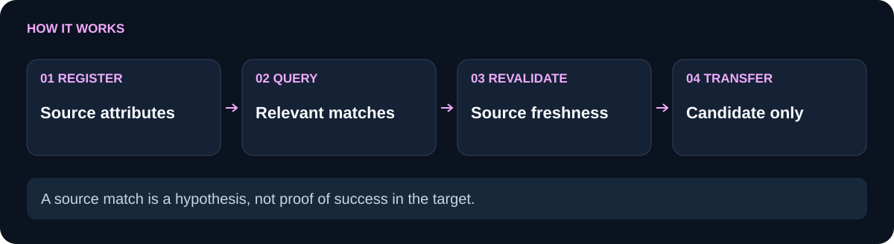

# genesis-context-graph

 

`genesis-context-graph` makes reusable context inspectable. You register a bounded source card with a SHA256 artifact, attributes, applicability, contraindications, and optional evaluation evidence. Queries match terms only while source evidence is current; an explicit approval receipt can be required for the returned candidate, and every transfer remains a candidate until the target validates it.

**Visible source provenance.** **Freshness-aware matching.** **Approval-aware candidates.**

[Use cases](#use-cases) · [How it works](#how-it-works) · [Quickstart](#quickstart) · [API](#api) · [Comparison](#comparison) · [Limitations](#limitations) · [Related components](#related-components)

## Use cases

Use the graph for reusable workflow patterns, evidence-backed context retrieval, or a small local provenance view before adapting a mechanism to a new task. A card might describe a bounded-check mechanism, its source document, the domains where it applies, and the constraints that should exclude it.

In a fictional onboarding project, an engineer copied a useful checklist from an old source file whose exceptions had since changed. With the graph, the stale digest is excluded, while a current card can be matched with its domain, contraindications, and approval evidence visible.

Use simpler code when there is one known source file and no need to compare several reusable attributes or explain why a candidate was excluded.

## How it works

<picture>
  <source media="(max-width: 600px)" srcset="docs/flow-compact.svg">
  
</picture>

Create a graph with caller-supplied `stateDir` and `sourceRoot`. A card contains `task: { id, label, domain }`, an `artifact: { path, sha256 }`, and one to twelve attributes. Each attribute stores a label, mechanism, tags, `appliesTo`, contraindications, and optional evidence proof. Registration checks that the files exist under `sourceRoot` and that their current SHA256 matches.

`query({ goal, attributes, domain, constraints }, { limit })` tokenizes the request, filters stale source or evidence, applies domain and contraindication rules, and returns at most five scored candidates plus excluded reasons, provenance, and missing evidence. Set `requireUserApproval: true` to exclude cards without a valid receipt. `revalidateCandidate(candidate, request)` checks the stored mechanism and proofs again before a target uses it. `recordTransfer` persists an immutable `candidate` proposal, while `snapshot` exposes a bounded graph view.

The diagram follows this route from source proof to a candidate transfer. “User approved” means the caller supplied a receipt whose JSON explicitly names the card, message reference, artifact SHA256, quote, and approved attribute IDs. It is evidence attached to the card, not an identity claim.

## Quickstart

```sh
git clone https://github.com/your-organization/genesis-context-graph.git
cd genesis-context-graph
npm test
npm run demo
```

Node.js 20 or newer is required. There are no runtime dependencies, so no `npm install` is needed. The demo creates temporary source, evidence, and approval files, registers one card, prints a bounded query result, and removes the temporary directory.

## API

```js
const fs = require('node:fs');
const crypto = require('node:crypto');
const { createContextGraph } = require('./index.cjs');

const sourceRoot = './sources';
fs.mkdirSync(sourceRoot, { recursive: true });
fs.writeFileSync(`${sourceRoot}/pattern.md`, 'bind each result to a criterion');
const sha256 = file => crypto.createHash('sha256').update(fs.readFileSync(file)).digest('hex');

const graph = createContextGraph({ stateDir: './state', sourceRoot });
graph.registerCard({
  id: 'card-1',
  task: { id: 'source-task', label: 'bounded checks', domain: 'workflow' },
  artifact: { path: 'pattern.md', sha256: sha256(`${sourceRoot}/pattern.md`) },
  attributes: [{
    id: 'trait-1',
    label: 'criterion-bound checks',
    mechanism: 'bind each result to a criterion',
    tags: ['evidence'],
    appliesTo: ['workflow'],
    contraindications: [],
  }],
});
console.log(graph.query({ goal: 'bounded evidence', domain: 'workflow' }));
```

An approval receipt is optional for ordinary reuse. If supplied, it must be a current JSON file with `kind: "user-approval"`, `approved: true`, the card ID, message reference, nonempty quote, matching source artifact SHA256, and all attribute IDs. The exports are `ContextGraph`, `createContextGraph`, `digest`, and `tokens`. See [module-manifest.json](module-manifest.json) for the full schema and [examples/demo.cjs](examples/demo.cjs) for an approval-backed runnable example.

## Comparison

| Context need | A keyword list or copied note | `genesis-context-graph` |
| --- | --- | --- |
| Know which source supports a reusable attribute | Source may be separated from the note | Card stores task, artifact proof, attribute mechanism, and optional evidence |
| Avoid using changed material | Freshness may be checked manually | Current SHA256 is checked on registration, query, and candidate revalidation |
| Filter by target context | Applicability rules are easy to overlook | Domain and contraindication constraints participate in matching |
| Distinguish approval from relevance | A relevant note may look authorized | `requireUserApproval` selects only candidates with a valid explicit receipt |
| Keep reuse provisional | Copying can imply completion | Transfers are immutable `candidate` proposals with target-specific evidence gaps |

## Limitations

Matching is lexical token overlap with bounded inspection and at most five returned candidates; it is not semantic search. The graph is local and does not scan external stores. Source, evidence, and approval proofs are caller-supplied files; approval receipts do not authenticate an external account, person, model, or message platform. A candidate says that a current source attribute appears applicable; it does not prove target success, and `recordTransfer` does not run the target checks. State is local and synchronous, with bounded card, attribute, and transfer counts.

The tests cover fresh approved matching, stale-source exclusion, approval validation, candidate revalidation, immutable cards, unapproved reuse, source-root symlink escapes, duplicate transfer proposals, and persistence rollback. Run `npm test` to verify these cases.

## Related components

- [genesis-task-ledger](https://github.com/your-organization/genesis-task-ledger) records criterion-bound checks and artifact proofs.
- [genesis-plan-graph](https://github.com/your-organization/genesis-plan-graph) schedules dependency-ready work with declared ownership.
- [genesis-task-adaptation](https://github.com/your-organization/genesis-task-adaptation) records source-backed changes and rechecks.
- [genesis-worker-router](https://github.com/your-organization/genesis-worker-router) routes injected providers under bounded limits.
- [genesis-suite](https://github.com/your-organization/genesis-suite) integrates the public modules.
