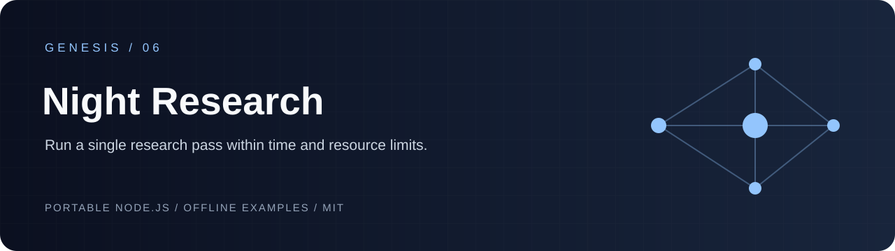
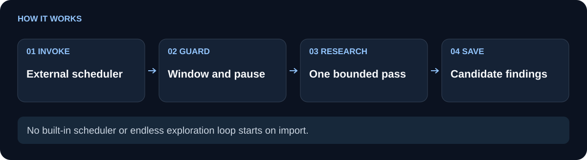

# Genesis Night Research

Run one small, timezone-aware research pass during a defined night window, prevent dispatch when the caller reports a pause or active gaming, and leave a bounded report for later human or independent validation.

**Time-window gating.** **One worker pass at a time.** **Unverified evidence stays unpromoted.**

[Problem and fit](#problem-and-fit) · [Workflow](#workflow) · [Quickstart](#quickstart) · [API](#api) · [Limits](#limits-and-boundaries) · [Verification](#verification) · [Related projects](#related-projects)

[](https://nodejs.org/) [](LICENSE)

<picture>
  <source media="(max-width: 600px)" srcset="docs/flow-compact.svg">
  
</picture>

## Problem and fit

Overnight research jobs are easy to start and hard to bound. A scheduler can run outside the intended hours, dispatch while a pause flag is set, or leave a result that looks more authoritative than the evidence supports. This package gives a caller-owned state directory, a small set of research questions, and a single pass contract that makes those states visible.

Use it when an application already has a worker or provider adapter and needs to decide whether to dispatch one pass. Typical cases include a 21:00–08:00 America/New_York research window, a quiet source-candidate queue, or an offline fixture for a workflow experiment. The package does not choose a provider or schedule a recurring job.

**Illustrative scenario:** a scheduler fires at 22:00 while a game is running. An unconditional worker call would start research; this gate returns an ineligible result before dispatch. After gaming ends, a later invocation may run one bounded pass. Pause and gaming checks occur before dispatch; they do not interrupt an already-running worker.

**Use simpler code when** a single manual research call needs no persisted night budget or activity gate.

## Workflow

The diagram shows the control flow: `status` computes the daylight-saving-aware local window and evaluates pause, gaming, state, and budget gates. An eligible `runPass` creates a lock, calls the supplied worker once with a deadline and abort signal, parses only bounded HTTP(S) source candidates, and writes JSON and Markdown reports. A report is a candidate record; later validation and promotion belong to the caller.

| Baseline | This component |
| --- | --- |
| A worker callback can run whenever its host invokes it. | `status` and `runPass` enforce the configured night window, pause/gaming gates, pass count, source count, and worker deadline. |
| A raw worker response has no standard persisted shape. | The caller-owned state directory receives `state.json` plus one JSON and one Markdown report per pass. |
| A source URL may be treated as accepted evidence immediately. | Parsed sources are limited to `http`/`https`, marked `validation: "unverified"`, and reports keep reward at `0`. |
| A hung pass can overlap a second dispatch. | `pass.lock` blocks another pass until the timed-out worker settles and the lock is released. |

The worker is deliberately injected. It receives `{ passId, question, maxSources, signal, deadlineMs }` and may return `{ ok: true, value }` or `{ ok: true, text }`, with optional provider metadata such as `actualModel`, `monetaryCost`, and `usage`.

## Quickstart

The repository has no runtime dependencies. Node 20 or newer is required.

```sh
git clone https://github.com/Wassimyounes01/genesis-night-research.git
cd genesis-night-research
npm test
npm run demo
```

`npm test` runs the offline Node test suite. `npm run demo` uses a disposable temporary directory, fixes the clock at a time inside the New York night window, supplies a local callback, and prints a JSON summary. It does not contact a provider.

For an application-owned pass:

```js
async function main() {
  const { runPass } = require('./index.cjs');
  
  const result = await runPass({
    stateDir: './research-state',
    isPaused: () => false,
    isGaming: () => false,
    worker: async ({ question, maxSources }) => ({
      ok: true,
      value: {
        question,
        summary: 'Candidate finding from the application worker.',
        sources: [{
          url: 'https://example.com/source',
          title: 'Example source',
          claim: 'A claim that still needs independent validation.',
        }].slice(0, maxSources),
      },
    }),
  });
  
  console.log(result.status, result.report);
}
main().catch(error => { console.error(error); process.exitCode = 1; });
```

For deterministic tests, pass `now` as epoch milliseconds. `isPaused` and `isGaming` may be booleans or callbacks. A callback that throws, or an omitted gaming state during an eligible window, fails closed as `unknown`.

## API

- `policy` exposes the frozen defaults: `America/New_York`, 21:00 start, 08:00 end, six passes per night, three sources per pass, and a 120,000 ms worker limit.
- `THEMES` contains three small questions for bounded routing, metadata-atlas, and review-evidence experiments.
- `nightWindow(epochMs, timezone)` returns local parts, the night date, window boundaries, eligibility, and remaining milliseconds.
- `status(options)` returns `ok`, `eligible`, reasons, attempts, and the active budgets without writing state.
- `runPass(options)` performs one gated pass and returns a bounded report path. It creates `pass.lock`, `state.json`, and `reports/` below the resolved `stateDir`.
- `parseCandidate(value, maxSources)` accepts an object or JSON string, keeps bounded text fields, and marks accepted sources unverified.
- `setPaused(paused, { stateDir })` creates or removes the caller-owned `paused.flag`.

A worker error, partial response, invalid output, or timeout is recorded as a non-success report. The timeout path keeps the lock while the outstanding worker promise settles, so a caller cannot accidentally overlap work that is still running.

## Limits and boundaries

This module owns the gate and report format; it does not install tools, invoke a model, fetch sources, schedule itself, validate citations, award reward, promote a finding, or send a message. A missing worker is reported as `worker-unavailable`. Source candidates are capped at three by default and each URL, title, claim, and report field is length-bounded.

`stateDir` is caller-owned and must be treated as application state. The lock coordinates callers using the same directory; it does not isolate a process from the operating system. A prompt, provider callback, or worker callback cannot enforce an OS sandbox, and this package does not claim to provide one. The caller remains responsible for credentials, network permissions, worker isolation, and independent source validation.

## Verification

The tests exercise daylight-saving-aware window calculation, closed gates, malformed counters, bounded source parsing, caller-owned pause state, worker failures, partial output, timeout lock retention, and disposable report cleanup. Run `npm test` from the repository root to repeat those checks; `npm run demo` verifies the documented offline path.

## Related projects

- [genesis-repo-atlas](https://github.com/Wassimyounes01/genesis-repo-atlas) records bounded repository metadata and provenance checks.
- [genesis-review-gate](https://github.com/Wassimyounes01/genesis-review-gate) turns an injected review adapter into a strict acceptance receipt.
- [genesis-suite](https://github.com/Wassimyounes01/genesis-suite) groups the public Genesis components.

See [examples/demo.cjs](examples/demo.cjs), [index.cjs](index.cjs), and [test/night-research.test.cjs](test/night-research.test.cjs) for the runnable demonstration and executable contract.

