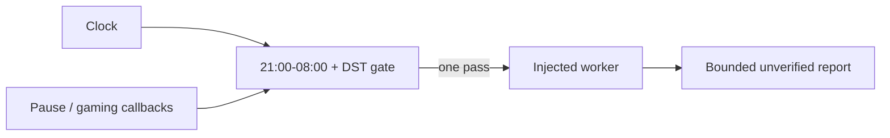

# Genesis Night Research

One bounded, timezone-aware research pass that yields to pause and gaming state and records source candidates for later validation.

[](https://nodejs.org/) [](LICENSE)



## Run locally

```sh
git clone https://github.com/Wassimyounes01/genesis-night-research.git
cd genesis-night-research
npm test
npm run demo
```

No dependency installation is required. The complete runnable setup is in [examples/demo.cjs](examples/demo.cjs); API snippets illustrate integration shapes.


Use it for a quiet overnight experiment, a source-candidate queue, or a small offline review of one concrete workflow question.

## Five-minute offline quickstart

```js
const { runPass } = require('./index.cjs');
const result = await runPass({
  stateDir: '/path/you/own/research-state',
  isPaused: () => false,
  isGaming: () => false,
  worker: async ({ question }) => ({ ok: true, value: { question, summary: 'candidate', sources: [] } }),
});
console.log(result);
```

The callback is the real integration point. It receives one pass ID, a shared deadline, an abort signal, a source budget, and one question. The default window is 21:00–08:00 in `America/New_York`, calculated through `Intl` so daylight-saving changes are represented. `isPaused` and `isGaming` can be functions; either gate stops dispatch. State is written only below the caller-supplied `stateDir`.

Reports keep source links unverified, reward at zero, and promotion disabled. The package does not install tools, schedule itself, run local inference, claim semantic research coverage, or send messages. Unknown model and cost fields remain `null`.

Run `npm test` for offline tests and `npm run demo` for a disposable-state demonstration. See [genesis-suite](https://github.com/Wassimyounes01/genesis-suite), [genesis-worker-router](https://github.com/Wassimyounes01/genesis-worker-router), [genesis-repo-atlas](https://github.com/Wassimyounes01/genesis-repo-atlas).
