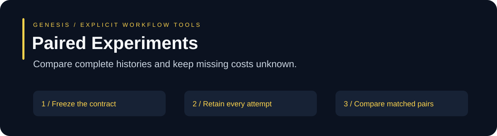
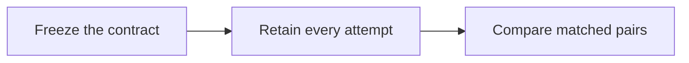

# Paired Experiments

Compare complete histories and keep missing costs unknown.

**CommonJS · Built-in modules only · Node.js 22.23.2 / 24.14.0 · MIT**

## Use it when

Preregistered baseline/candidate diagnostics with held-out cases and explicit rubrics.

The API takes an explicit, bounded contract and returns inspectable results. It runs locally as part of your application. No provider account, daemon, or dependency installation is required.

## Start locally

```sh
npm test
npm run demo
npm run verify
```

```js
const { preregisterExperiment, analyzeExperiment, normalizeCodexUsage } = require('./');
```

See the [working demo](examples/demo.cjs) and [complete test fixtures](test/index.test.cjs) for exact request shapes. The demo uses public synthetic input; its numbers are examples, not product-performance measurements.

## Flow



| Contract | Visible result | Host responsibility |
| --- | --- | --- |
| Explicit inputs and limits | Bounded output and named gaps | Choose authorized source and task scope |
| Exact bytes or observed values | Provenance or explicit unknowns | Collect trustworthy evidence |
| Candidate result | A reviewable draft or diagnostic | Perform current checks and final review |

## Limits

Caller-supplied grades and histories need trustworthy collection. Checksums do not authenticate a grader. Missing telemetry stays unknown; worker tokens do not establish whole-pipeline cost. Diagnostic cases do not prove general performance.

No quality multiplier or general token/cost reduction is established here. Keep failed attempts and missing usage in any comparison. These modules neither train model weights nor replace governing controls.

## Inventory and verification

[FILES.json](FILES.json) lists exact exported files and SHA-256 hashes; it excludes itself from its own hash set. [SOURCE-MANIFEST.json](SOURCE-MANIFEST.json) records the original code inputs by portable name and hash. [LOCAL-VERIFICATION.json](LOCAL-VERIFICATION.json) records actual local test counts, runtime and demo status. CI covers the declared Node versions on Linux and Windows; configured jobs are not claimed as already executed.

Original code and its bundled local dependencies use the [MIT license](LICENSE). Preserve that notice when adapting the package. No third-party npm code is bundled.
