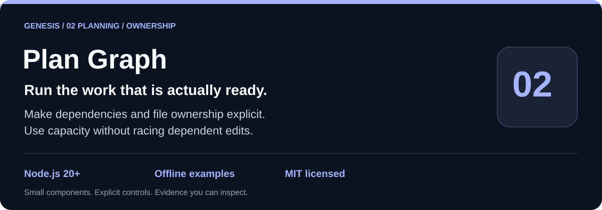
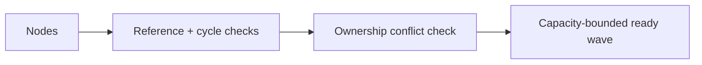

# genesis-plan-graph

 

`genesis-plan-graph` keeps bounded workflow plans executable: it validates dependency references and cycles, enforces workspace-relative ownership, and returns only dependency-ready work that fits configured capacity without overlapping writes.



## Run locally

```sh
git clone https://github.com/Wassimyounes01/genesis-plan-graph.git
cd genesis-plan-graph
npm test
npm run demo
```

No dependency installation is required. The complete runnable setup is in [examples/demo.cjs](examples/demo.cjs); API snippets illustrate integration shapes.


Practical uses include packetized code work, review pipelines, and offline task schedulers where a plan is data and execution remains the caller’s responsibility.

## API and five-minute offline start

```js
const { createPlanGraph } = require('./index.cjs');
const graph = createPlanGraph({ capacity: 2, nodes: [
  { id: 'draft', task: 'draft', dependsOn: [], owns: ['draft.md'] },
  { id: 'review', task: 'review', dependsOn: ['draft'], owns: [], readOnly: true }
] });
console.log(graph.ready([], []).ready);
```

Run `npm test` and `npm run demo` without installing dependencies.

The exact export and input schema is in [module-manifest.json](module-manifest.json).

## Invariants and limitations

Nodes have simple bounded IDs, explicit dependencies, and write ownership unless marked read-only. Unknown dependencies and cycles fail immediately. Ownership uses normalized relative paths and treats parent/child paths as overlapping. `ready` is deterministic for a given insertion order, completion set, and capacity; it does not start workers, persist state, or prove that a worker respected its declared ownership. Capacity limits are local scheduling constraints, not distributed locks.

See [genesis-task-ledger](https://github.com/Wassimyounes01/genesis-task-ledger), [genesis-task-adaptation](https://github.com/Wassimyounes01/genesis-task-adaptation), [genesis-context-graph](https://github.com/Wassimyounes01/genesis-context-graph), and [Genesis Suite](https://github.com/Wassimyounes01/genesis-suite) (final owner links are filled by the coordinator).
