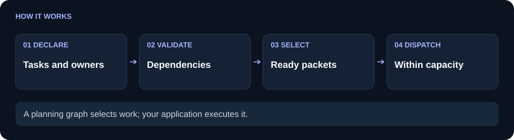

# genesis-plan-graph

 

`genesis-plan-graph` keeps a bounded workflow plan executable. It validates dependency references, cycles, depth, and workspace-relative ownership, then returns the dependency-ready work that fits configured capacity without overlapping writes. It describes a safe wave for the caller to run; it does not start workers or claim that a worker obeyed its declaration.

**Explicit dependencies.** **Declared write ownership.** **Deterministic ready waves.**

[Use cases](#use-cases) · [How it works](#how-it-works) · [Quickstart](#quickstart) · [API](#api) · [Comparison](#comparison) · [Limitations](#limitations) · [Related components](#related-components)

## Use cases

Use the graph for packetized code work, review stages, offline task schedulers, or any plan where several independent tasks can be offered together while dependent tasks wait. A common plan has a specification owning `spec.md`, implementation owning `src/`, and a read-only review depending on the implementation.

In a fictional documentation sprint, two workers once edited `docs/` at the same time because both tasks looked independent, leaving one change overwritten. With the graph, the ownership overlap blocks that pair while the dependency-ready wave still offers unrelated work.

Use simpler code when the plan is a single sequential command with no dependencies, parallel capacity, or shared write paths to validate.

## How it works

<picture>
  <source media="(max-width: 600px)" srcset="docs/flow-compact.svg">
  
</picture>

Each node has an ID, task label, `dependsOn` IDs, and `owns` paths. Write nodes must declare at least one workspace-relative path; read-only nodes may own nothing. Paths are normalized and parent/child paths overlap, so `src/` conflicts with `src/index.cjs`. Unknown dependencies, self or duplicate dependencies, cycles, unsafe paths, excessive depth, and capacity overflow are rejected.

`validate()` returns a structural result with the topological order. `ready(completedIds, runningIds)` returns `ready`, `running`, `capacity`, and `blocked`; it skips completed or running nodes, requires all dependencies to be completed, avoids ownership overlap with active or selected nodes, and stops at capacity. The flow image follows that sequence from input validation to the dispatch decision.

## Quickstart

```sh
git clone https://github.com/Wassimyounes01/genesis-plan-graph.git
cd genesis-plan-graph
npm test
npm run demo
```

Node.js 20 or newer is required. There are no runtime dependencies, so no `npm install` is needed. The demo prints validation, the first ready wave, and the next wave after `spec` completes.

## API

```js
const { createPlanGraph } = require('./index.cjs');

const graph = createPlanGraph({
  capacity: 2,
  nodes: [
    { id: 'spec', task: 'write specification', dependsOn: [], owns: ['spec.md'] },
    { id: 'code', task: 'implement module', dependsOn: ['spec'], owns: ['src/'] },
    { id: 'review', task: 'review implementation', dependsOn: ['code'], owns: [], readOnly: true },
  ],
});

console.log(graph.validate());
console.log(graph.ready([], []).ready.map(node => node.id)); // [ 'spec' ]
console.log(graph.ready(['spec'], []).ready.map(node => node.id)); // [ 'code' ]
```

The public exports are `PlanGraph`, `createPlanGraph`, `validateGraph`, and `ownershipOverlaps`. Use `add`, `replace`, `get`, `list`, `topologicalOrder`, `validate`, and `ready` as the graph lifecycle requires. The exact node schema and bounds are in [module-manifest.json](module-manifest.json); [examples/demo.cjs](examples/demo.cjs) is runnable as-is.

## Comparison

| Scheduling need | A list of tasks or ad hoc queue | `genesis-plan-graph` |
| --- | --- | --- |
| Catch dependency mistakes early | Missing links fail later during dispatch | Unknown references and cycles fail at graph construction or validation |
| Avoid overlapping writes in a wave | Usually depends on convention | Normalized parent/child ownership paths are checked against active and selected nodes |
| Respect limited capacity | Queue policy lives elsewhere | `ready` selects at most configured capacity, including already running work |
| Explain why work waits | Often implicit | Response includes blocked IDs alongside ready and running IDs |
| Keep planning separate from execution | Queue may own worker behavior | Returns data for the caller; no process launch or worker mutation occurs |

## Limitations

The graph is in memory unless the caller serializes it. Ownership is declarative and cannot prevent an external process from writing outside the scheduler or from violating its declared paths. Capacity is a local selection limit, not a distributed lock. Read-only nodes are exempt from write ownership, so the caller still decides whether their actual behavior is read-only. The graph does not retry, persist completion, execute commands, or observe provider state. Bounds are intentional: by default there are at most 50 nodes, depth 10, and capacity 3; constructor options can set bounded alternatives.

The tests cover dependency-ready selection, disjoint ownership, cycles, missing references, unsafe paths, capacity overflow, read-only nodes, and dependency depth. Run `npm test` to verify the behavior in this checkout.

## Related components

- [genesis-task-ledger](https://github.com/Wassimyounes01/genesis-task-ledger) records criterion-bound checks and reviewed artifacts.
- [genesis-task-adaptation](https://github.com/Wassimyounes01/genesis-task-adaptation) turns feedback into explicit revisions and rechecks.
- [genesis-context-graph](https://github.com/Wassimyounes01/genesis-context-graph) finds current source-backed attributes for a target task.
- [genesis-worker-router](https://github.com/Wassimyounes01/genesis-worker-router) applies deadlines, retries, account caps, and concurrency limits to injected providers.
- [genesis-suite](https://github.com/Wassimyounes01/genesis-suite) integrates the public modules.
