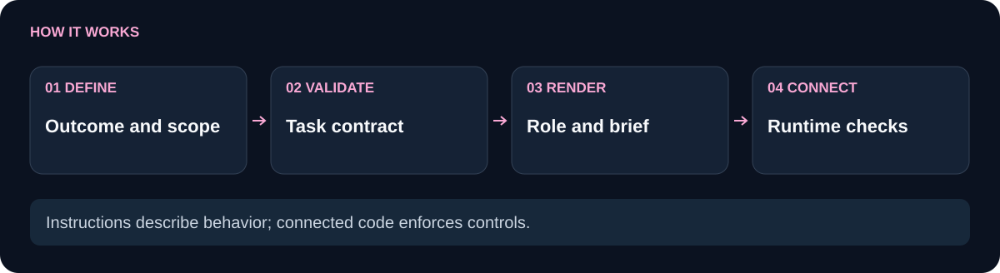

# Genesis Prompt Kit

**Turn “do this well” into a task brief with a clear owner, concrete checks and a stopping rule.**

Original operating prompts, role contracts and a strict task schema for developers building agent workflows. Use the text by itself, render it from Node.js, or connect it to the Genesis runtime.

**Explicit acceptance · Teachable worker packets · Deterministic rendering**

[](https://nodejs.org/) [](LICENSE) [](https://github.com/Wassimyounes01/genesis-prompt-kit/actions)

[Why use it](#why-use-it) · [Quickstart](#quickstart) · [Foundations](docs/FOUNDATIONS.md) · [Design prompt](docs/REPOSITORY-DESIGN-PROMPT.md) · [Limits](#limits)

## Why use it

A broad instruction such as “build the feature and verify it” leaves the definition of done implicit. Different workers may choose different outputs, skip a failure case or continue after useful work is finished. Prompt Kit gives those decisions a visible structure before dispatch.

Use it for repeated task types, planner-to-worker handoffs, or rejecting malformed task packets before a model call. For a one-off question with no handoff or acceptance contract, ordinary concise instructions may be enough.

| Starting workflow | What this kit adds | What still needs your application |
| --- | --- | --- |
| A freeform request with an implied finish line | Required acceptance checks and a stopping rule | Checks that actually run against the output |
| One large prompt copied into every task | Separate system, project, role, teaching and task templates | Selecting useful layers for the task |
| “Use this coding style” without an example | A pattern, invariant, counterexample and acceptance teaching contract | Relevant code examples and meaningful tests |
| A claim that prompting makes agents reliable | Inspectable original text and deterministic schema validation | Empirical quality and cost evaluation |

## How it works

<picture>
  <source media="(max-width: 600px)" srcset="docs/flow-compact.svg">
  
</picture>

The renderer produces text; it does not execute the task. `validateTaskContract` checks the complete object, including unknown keys. `createTaskContract` builds the supported shape from supplied fields and defaults. [Genesis Suite](https://github.com/Wassimyounes01/genesis-suite) connects these briefs to bounded workers, checks and review evidence.

## Quickstart

Requires Node.js 20 or later. No dependency installation, account, model or service is needed for the examples.

```sh
git clone https://github.com/Wassimyounes01/genesis-prompt-kit.git
cd genesis-prompt-kit
npm test
npm run demo
node index.cjs render role --role reviewer
node index.cjs render repository
```

The [offline demo](examples/demo.cjs) renders public templates and a validated task contract. The last command prints the reusable repository-design prompt; it does not edit or publish a repository.

## A brief you can inspect

Run this from the repository root or save it as a `.cjs` file there:

```js
const { createTaskContract, renderPrompt } = require('./index.cjs');
const task = createTaskContract({
  id: 'document-parser',
  objective: 'Document the parser using its actual exports and tests',
  owner: 'docs-worker',
  inputs: ['index.cjs', 'test/parser.test.cjs'],
  outputs: ['README.md'],
  constraints: ['Do not claim unsupported formats'],
  acceptance: ['Documented commands run', 'Every format claim matches a test'],
  budget: { maxAttempts: 1, deadlineMs: 10000, maxOutputBytes: 65536 },
  stopCondition: 'Return the README and check results, or name the missing evidence',
});
console.log(renderPrompt('task', task));
```

The brief includes the owner, inputs, outputs, acceptance, budget and stop condition. An empty acceptance list or zero attempt budget is rejected. Budget fields are a contract, not a timer: a connected runner must enforce execution limits.

## Three circumstances where it helps

- **A repository needs a better public page.** Render `repository`, supply the code and audience, and apply its content, visual and verification tracks. The [design profile](docs/REPOSITORY-DESIGN-PROMPT.md) was applied across the eleven Genesis repositories; its [trial record](docs/DESIGN-TRIAL.md) distinguishes checked structure from unmeasured user outcomes.
- **A worker repeatedly misses an edge case.** Render the teaching contract and supply a minimal correct pattern, invariant and failing example. The acceptance task should exercise that failure, rather than asking the worker to “be more careful.”
- **A multi-package change needs reliable handoffs.** Give each packet its own owner, dependencies and checks, then use [Plan Graph](https://github.com/Wassimyounes01/genesis-plan-graph) and [Suite](https://github.com/Wassimyounes01/genesis-suite) to connect the workflow.

## The foundation: analysis, adaptation, verification

Genesis was informed in part by a supplied collection labeled as system-prompt leaks. Development separated recurring mechanisms—scope, tool contracts, planning, verification, context and stopping rules—then wrote original task-oriented instructions and corresponding runtime controls.

The collection's authenticity is unverified. The public kit contains original wording, not vendor prompt dumps. Prompt analysis alone cannot explain a model's coding ability or prove better outputs. Read the [full provenance, process and pattern-to-code mapping](docs/FOUNDATIONS.md).

## Limits

This is a prompting and contract library, not a model, autonomous service or security sandbox. It does not authenticate a reviewer, run your acceptance checks, train weights or prove token savings. The [operating charter](GENESIS.md) is a reusable project instruction; host policies and actual user authority still govern.

No general quality advantage over other prompting systems has been benchmarked here. The concrete difference is inspectable structure and connections to runtime checks. Choose the parts that prevent failures in your workflow.

## Explore and verify

[API and bounds](module-manifest.json) · [Template source](index.cjs) · [Behavioral tests](test/prompt-kit.test.cjs) · [Verification](VERIFICATION.md) · [Contributing](CONTRIBUTING.md) · [Security](SECURITY.md)

Next: [Review Gate](https://github.com/Wassimyounes01/genesis-review-gate) for incomplete-review handling, [Charter Lab](https://github.com/Wassimyounes01/genesis-charter-lab) for measured instruction changes, or [Genesis Suite](https://github.com/Wassimyounes01/genesis-suite) for the connected workflow.

The complete reusable operating charter is [GENESIS.md](GENESIS.md).
