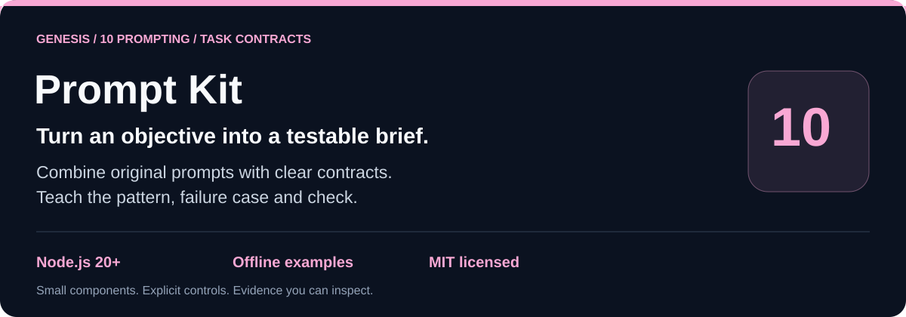
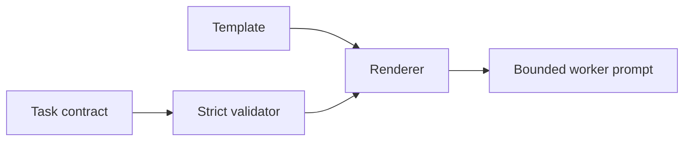

# genesis-prompt-kit

[](https://nodejs.org/) [](LICENSE)

`genesis-prompt-kit` provides original public Genesis system/project templates, role and teaching contracts, and a strict task-contract renderer usable from CommonJS or a small offline CLI.



## Run locally

```sh
git clone https://github.com/Wassimyounes01/genesis-prompt-kit.git
cd genesis-prompt-kit
npm test
npm run demo
```

No dependency installation is required. The complete runnable setup is in [examples/demo.cjs](examples/demo.cjs); API snippets illustrate integration shapes.


Use it to render a planner brief, teach a worker with an invariant and counterexample, or validate a task packet before dispatch. The text is deliberately public and original; it contains no hidden vendor instructions, private corpus, credential, model-weight or machine-specific claim.

## Five-minute offline quickstart

```sh
npm test
npm run demo
node index.cjs render role --role reviewer
```

```js
const { createTaskContract, renderPrompt } = require('./index.cjs');
const task = createTaskContract({
  id: 'packet-1', objective: 'Check a fixture', owner: 'worker',
  outputs: ['receipt'], acceptance: ['receipt is valid'], stopCondition: 'Stop after one check.',
});
console.log(renderPrompt('task', task));
```

Contracts reject unknown keys, missing fields, empty acceptance lists and non-positive budgets. Rendering is deterministic and has no network or model side effect. Workflow feedback is not biological dopamine and does not train model weights.

Run `node --test` (or `npm test`). Adjacent projects: [genesis-review-gate](https://github.com/Wassimyounes01/genesis-review-gate), [genesis-charter-lab](https://github.com/Wassimyounes01/genesis-charter-lab), and [genesis-suite](https://github.com/Wassimyounes01/genesis-suite).

The complete reusable operating charter is [GENESIS.md](GENESIS.md).
