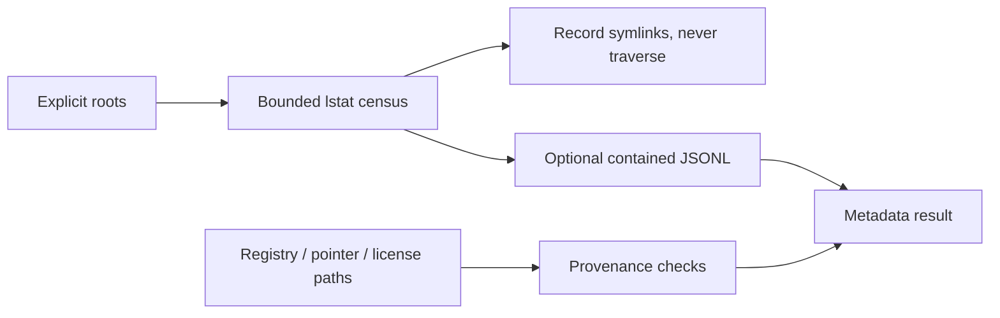

# Genesis Repo Atlas

A bounded metadata census for explicit repository roots, with symlink-safe traversal and small registry, pointer, and license provenance checks.

[](https://nodejs.org/) [](LICENSE)



## Run locally

```sh
git clone https://github.com/Wassimyounes01/genesis-repo-atlas.git
cd genesis-repo-atlas
npm test
npm run demo
```

No dependency installation is required. The complete runnable setup is in [examples/demo.cjs](examples/demo.cjs); API snippets illustrate integration shapes.


Use it to inventory package boundaries, produce a small build manifest, or check that release pointers and licenses stay contained and present.

## Five-minute offline quickstart

```js
const { scan } = require('./index.cjs');
const result = scan({ roots: ['/path/you/own/repository'], maxEntries: 5000 });
console.log(result.counts, result.coverage);
```

The scanner calls `lstat`, records root-relative metadata, skips symbolic links and Windows reparse points, and stops at explicit entry and metadata-byte caps. An optional `outputPath` is required to remain inside an explicit root and is written as bounded JSONL. Provenance checks read only caller-named, bounded registry, pointer, and license files; all paths must be relative and contained.

The result intentionally states `metadata-only` coverage and `semanticCoverageClaim: false`. It does not read every file, infer repository meaning, follow links, publish, or claim semantic-all-files coverage.

Run `npm test` for isolated tests and `npm run demo` for an offline fixture. See [genesis-suite](https://github.com/Wassimyounes01/genesis-suite), [genesis-worker-router](https://github.com/Wassimyounes01/genesis-worker-router), [genesis-night-research](https://github.com/Wassimyounes01/genesis-night-research).
