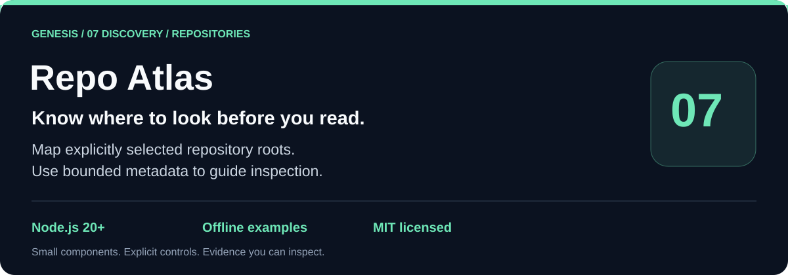
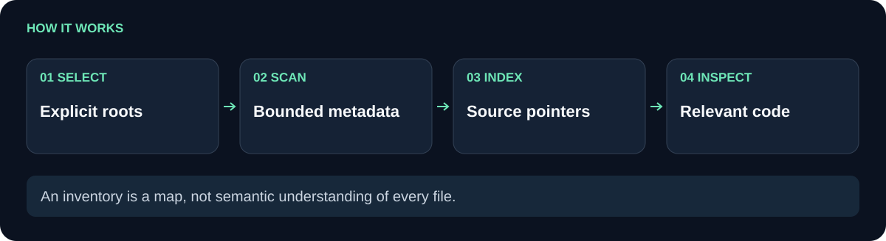

# Genesis Repo Atlas

Scan explicit repository roots into a bounded metadata census, record links without traversing them, and optionally check caller-named registry, pointer, and license paths for contained provenance.

**Explicit roots.** **Symlink-aware traversal.** **Metadata-only results.**

[Problem and fit](#problem-and-fit) · [Workflow](#workflow) · [Quickstart](#quickstart) · [API](#api) · [Limits](#limits-and-boundaries) · [Verification](#verification) · [Related projects](#related-projects)

[](https://nodejs.org/) [](LICENSE)

<picture>
  <source media="(max-width: 600px)" srcset="docs/flow-compact.svg">
  
</picture>

## Problem and fit

Release tooling often needs to know which files and directories exist, whether a small registry points inside the release root, and whether named license files are present. Walking arbitrary links or reading every file makes that inventory harder to reason about. Repo Atlas keeps the input roots explicit and the scan bounded while returning coverage information that says exactly what was inspected.

Use it for a package census, a small build manifest, release-pointer checks, or a CI preflight that needs root-relative metadata. The caller chooses the roots and the optional provenance paths. The package does not infer repository meaning from source contents.

**Illustrative scenario:** a release tree contains a link into a large unrelated directory. An unrestricted recursive walk could traverse it; Atlas records the link and skips traversal, keeping the result within the selected roots and caps. It then gives a maintainer paths to inspect, not a claim to understand their code.

**Use simpler code when** a fixed list of a few files is enough and you do not need bounded traversal or provenance-path checks.

## Workflow

The diagram represents `scan`: each explicit root is resolved as a real directory, entries are read with `lstat`, metadata records are accumulated until an entry or metadata-byte cap is reached, and symlinks or Windows reparse points are recorded with `traversed: false`. If requested, contained JSONL is written alongside the scan. `checkProvenance` then validates only the caller-named registry, pointer, and license paths.

| Baseline | This component |
| --- | --- |
| A directory walk may follow a link into an unrelated tree. | Links and Windows reparse points are recorded, then never traversed. |
| A scan can silently grow with repository size. | `maxEntries` and `maxMetadataBytes` bound records; the result exposes `truncated`. |
| A manifest path may escape the selected root. | Output paths must be contained under an explicit root; registry, pointer, license and registry-entry paths must also be relative. |
| A file inventory may imply content or semantic coverage. | Results state `metadata-only` coverage and set `semanticCoverageClaim: false`. |

## Quickstart

The repository has no runtime dependencies. Node 20 or newer is required.

```sh
git clone https://github.com/Wassimyounes01/genesis-repo-atlas.git
cd genesis-repo-atlas
npm test
npm run demo
```

`npm test` runs the offline Node test suite. `npm run demo` builds a disposable fixture, scans it with a small cap, checks a contained provenance fixture, and removes the temporary directory. It does not inspect the host workspace or contact a service.

For a caller-owned root:

```js
const { scan } = require('./index.cjs');

const result = scan({
  roots: ['./repository-to-inspect'],
  maxEntries: 5000,
  maxMetadataBytes: 2 * 1024 * 1024,
  outputPath: './repository-to-inspect/atlas.jsonl',
});

console.log(result.counts, result.coverage, result.truncated);
```

`outputPath` must be inside one of the explicit roots and have non-link parents. Each record contains a `rootId`, root-relative `path`, `kind`, and file metadata such as `bytes` and `mtimeMs`.

To check known release files:

```js
const { checkProvenance } = require('./index.cjs');

const provenance = checkProvenance({
  root: './repository-to-inspect',
  registryPath: 'registry.json',
  pointerPath: 'pointer.json',
  licenseFiles: ['package/LICENSE'],
});
console.log(provenance.valid, provenance.registry, provenance.pointer, provenance.licenses);
```

Registry JSON may be an array or an object with `packages` or `entries`; each entry must name an existing contained non-link path. A pointer must resolve to an existing contained relative path. Named licenses must be regular files and are read only within the 64 KiB bounded check.

## API

- `scan({ roots, maxEntries, maxMetadataBytes, outputPath, provenance })` returns `schema: "genesis-repo-atlas/1"`, entries, counts, skipped links, errors, truncation, and coverage.
- `checkProvenance({ root, registryPath, pointerPath, licenseFiles })` returns separate `registry`, `pointer`, and `licenses` results plus `valid`.
- `contained(candidate, root)` checks lexical containment; `containedPath(candidate, root)` also rejects link or reparse-point path components.
- `extractPointer(value)` extracts `target`, `path`, `repository`, or `pointer` from a pointer record.
- `extractRegistryEntries(value)` accepts an array, `packages`, or `entries` and returns the entry array.

Defaults are 10,000 entries and 2 MiB of JSONL metadata. Individual registry, pointer, and license checks read at most 64 KiB. A malformed or missing named file makes its provenance section invalid; a bounded scan can still return its metadata with errors and `truncated` status visible.

## Limits and boundaries

Repo Atlas does not read every source file, parse package semantics, inspect Git history, prove that a release is safe, or claim semantic-all-files coverage. It reports filesystem metadata available to the caller process. The explicit-root and contained-path checks reduce accidental escapes, but they are not an OS sandbox; process permissions, mounts, network access, and file races remain the caller’s responsibility.

Symlinks are skipped based on the metadata observed during the scan. The package does not guarantee a race-free snapshot if a directory changes while it is being read. Provenance checks are opt-in and only cover the paths named by the caller; an unlisted license or registry is outside the result.

## Verification

The tests cover link skipping, root containment, output truncation, bounded JSONL, rejected escapes, valid and invalid registry/pointer/license fixtures, and the explicit `semanticCoverageClaim: false` contract. Run `npm test` from the repository root to repeat them; `npm run demo` verifies the documented offline flow.

## Related projects

- [genesis-night-research](https://github.com/Wassimyounes01/genesis-night-research) produces bounded, unverified research candidates.
- [genesis-review-gate](https://github.com/Wassimyounes01/genesis-review-gate) validates injected review findings and refutations.
- [genesis-suite](https://github.com/Wassimyounes01/genesis-suite) groups the public Genesis components.

See [examples/demo.cjs](examples/demo.cjs), [index.cjs](index.cjs), and [test/repo-atlas.test.cjs](test/repo-atlas.test.cjs) for the runnable example and executable contract.

