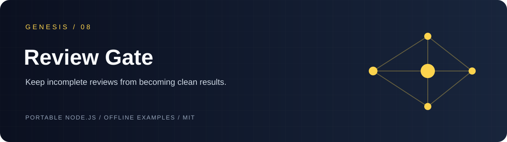
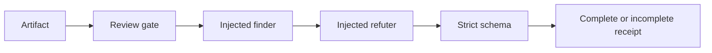

# genesis-review-gate

[](https://nodejs.org/) [](LICENSE)

`genesis-review-gate` turns an injected finder/refuter adapter into a bounded, artifact-bound acceptance receipt. It keeps provider failures, partial output, deadlines and size limits visibly incomplete.



## Run locally

```sh
git clone https://github.com/Wassimyounes01/genesis-review-gate.git
cd genesis-review-gate
npm test
npm run demo
```

No dependency installation is required. The complete runnable setup is in [examples/demo.cjs](examples/demo.cjs); API snippets illustrate integration shapes.


Use it to gate a generated patch before merge, to require every static-analysis finding to receive an explicit refutation, or to wrap a remote reviewer while preserving a shared deadline. The adapter is supplied by your application; this package never contacts a provider.

## Five-minute offline quickstart

```sh
npm test
npm run demo
```

```js
const { reviewArtifact } = require('./index.cjs');
const result = await reviewArtifact({ artifactId: 'build-7', artifact: { files: ['index.cjs'] } }, {
  async find() { return { provider: { name: 'my-reviewer', model: 'v1' }, findings: [] }; },
  async refute() { return { status: 'refuted', reason: 'required by the adapter contract' }; },
});
if (result.status !== 'complete') throw new Error('review evidence is incomplete');
```

The public result schema is strict: every finding has `id`, `severity`, `title`, `description` and `evidence`; every finding must receive `{status:'refuted', reason}`. Errors are `provider`, `partial`, `timeout` or `oversized`. Unknown provider identity stays in the receipt rather than being inferred. This is a workflow evidence gate, not a claim about model weights or biological reward.

Run `node --test` (or `npm test`). Adjacent projects: [genesis-charter-lab](https://github.com/Wassimyounes01/genesis-charter-lab), [genesis-prompt-kit](https://github.com/Wassimyounes01/genesis-prompt-kit), and [genesis-suite](https://github.com/Wassimyounes01/genesis-suite).
