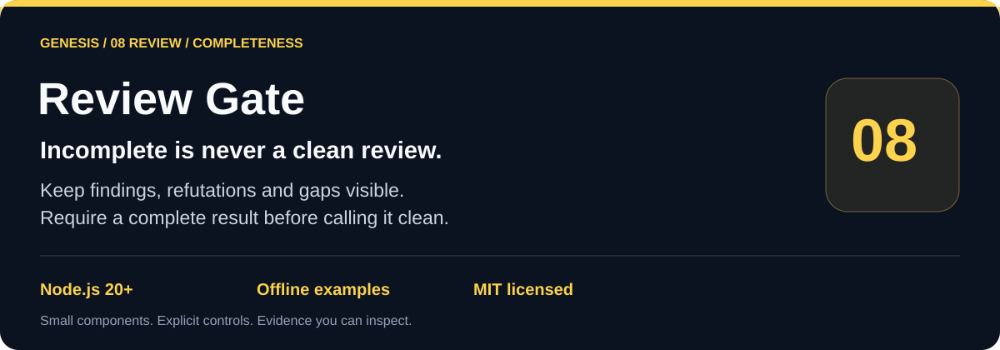
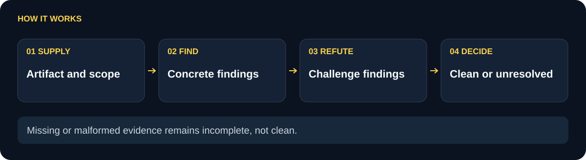

# Genesis Review Gate

Turn an injected `find`/`refute` adapter into a bounded review receipt with an explicit artifact identifier. The gate keeps provider errors, malformed or partial output, cancellation, deadlines, and size limits visible as `incomplete` evidence.

**Strict finding schemas.** **One shared deadline.** **Complete only after every refutation.**

[Problem and fit](#problem-and-fit) · [Workflow](#workflow) · [Quickstart](#quickstart) · [API](#api) · [Limits](#limits-and-boundaries) · [Verification](#verification) · [Related projects](#related-projects)

[](https://nodejs.org/) [](LICENSE)

<picture>
  <source media="(max-width: 600px)" srcset="docs/flow-compact.svg">
  
</picture>

## Problem and fit

A review integration can return a provider error, a partial finding list, or an unresolved finding while downstream code still expects an acceptance decision. Review Gate gives that integration one public result shape. It binds the result to an artifact ID, preserves the provider identity supplied by the adapter, and makes incomplete work explicit.

Use it before merging a generated patch, around a static-analysis service whose findings need an explicit disposition, or in an offline test harness for a remote reviewer. Your application supplies the adapter; this package never starts a service or calls a model.

**Illustrative scenario:** a reviewer returns one finding but the refuter times out. A resolved-promise check could mistake that response for success; Review Gate preserves an incomplete result. Your application keeps the task open or routes it for further review.

**Use simpler code when** a deterministic local check already has a clear pass/fail contract and needs no finder/refuter protocol.

## Workflow

The diagram shows the two-stage workflow. `reviewArtifact` validates the artifact and limits, creates one overall deadline and abort signal, calls `find`, validates the exact provider/finding schema, then calls `refute` for each finding through the same deadline. It returns `complete` only when every finding has `{ status: "refuted", reason }` and the final result passes the strict public schema. Any failure returns `incomplete` with a bounded error code.

| Baseline | This component |
| --- | --- |
| A caller may treat a resolved promise as an accepted review. | Acceptance requires a schema-valid result with every finding explicitly refuted. |
| Finder and refuter calls may each receive unrelated timeouts. | Both stages share one deadline and an abort signal; timeout aborts the adapter signal. |
| Provider failures and malformed output can be thrown away or mistaken for approval. | Errors are normalized as `provider`, `partial`, `timeout`, `oversized`, or `aborted` in the receipt. |
| A result may lose which artifact was reviewed. | The supplied `artifactId`, or a short deterministic artifact hash, is carried in the result. |

## Quickstart

The repository has no runtime dependencies. Node 20 or newer is required.

```sh
git clone https://github.com/your-organization/genesis-review-gate.git
cd genesis-review-gate
npm test
npm run demo
```

`npm test` runs the offline Node test suite. `npm run demo` supplies fixture adapters, reviews one finding, and prints the complete receipt. It does not contact a provider.

For a minimal offline fixture (the refutation is canned, not a real review):

```js
async function main() {
  const { reviewArtifact } = require('./index.cjs');
  
  const result = await reviewArtifact(
    { artifactId: 'build-7', artifact: { files: ['index.cjs'] } },
    {
      async find({ artifact, artifactId }) {
        return {
          provider: { name: 'my-reviewer', model: 'v1' },
          findings: [{
            id: 'missing-check',
            severity: 'medium',
            title: 'Missing check',
            description: 'A check is absent.',
            evidence: `${artifactId}: ${artifact.files[0]}`,
          }],
        };
      },
      async refute({ finding }) {
        return { status: 'refuted', reason: `Covered by the validated contract for ${finding.id}.` };
      },
    },
  );
  
  if (result.status !== 'complete') throw new Error(JSON.stringify(result.errors));
  console.log(result);
}
main().catch(error => { console.error(error); process.exitCode = 1; });
```

`find` must return exactly `{ provider: { name, model }, findings }`. Every finding must have exactly `id`, `severity`, `title`, `description`, and `evidence`, with a unique bounded ID. `refute` must return exactly `{ status: "refuted", reason }`. `signal` and `deadlineAt` let an adapter stop its own work promptly.

## API

- `reviewArtifact(input, adapter, options)` runs one review. `input.artifact` is used when present; otherwise the input itself is the artifact. An absent `artifactId` becomes a 24-character SHA-256-derived ID.
- `createReviewGate(options)` returns a frozen object with `review(input, adapter)` using those options.
- `validateFinding`, `validateFinderResponse`, `validateRefutation`, and `validateReviewResult` return `null` for valid values or a diagnostic string.
- `DEFAULTS` sets a 10,000 ms deadline, 256 KiB input/output limits, and 100 findings. `HARD_LIMITS` caps caller values at 120,000 ms, 4 MiB, and 1,000 findings.

The public receipt has `status`, `artifactId`, `findings`, `provider`, and `errors`. A partial result preserves valid findings with `refutation: null` where the process stopped. Provider identity is copied only when it is valid; failures use bounded `unknown` identity rather than guessing.

## Limits and boundaries

A caller-supplied artifact ID is copied into the receipt; the gate does not prove that it identifies the current artifact bytes. If omitted, the ID is derived from the serialized artifact. Use content-bound checks in the host, such as Suite’s ledger integration, when current-byte verification is required.

This is an evidence gate for an adapter workflow. It does not decide whether a finding is substantively correct, prove that a provider is independent, inspect model weights, or claim a review has run when an adapter failed. A complete receipt means the supplied adapter met the package contract and the receipt schema; it is not a security certification or a merge operation.

The adapter callback is caller code. A prompt or provider callback cannot enforce an OS sandbox, and this package does not provide one. The caller remains responsible for provider credentials, network access, artifact confidentiality, adapter isolation, and the meaning of each refutation. The gate bounds JSON values and timers but cannot stop an adapter that ignores cancellation from consuming external resources after return.

## Verification

The tests cover complete refutations, provider failure, unresolved findings, unknown keys, shared deadlines, oversized artifacts, malformed finder responses, caller aborts, signal propagation, and synchronous abort cleanup. Run `npm test` from the repository root to repeat the contract checks; `npm run demo` verifies the documented offline integration.

## Related projects

- [genesis-charter-lab](https://github.com/your-organization/genesis-charter-lab) evaluates public role text through preregistered evidence.
- [genesis-prompt-kit](https://github.com/your-organization/genesis-prompt-kit) packages bounded prompt inputs.
- [genesis-suite](https://github.com/your-organization/genesis-suite) groups the public Genesis components.

See [examples/demo.cjs](examples/demo.cjs), [index.cjs](index.cjs), and [test/review-gate.test.cjs](test/review-gate.test.cjs) for the runnable example and executable contract.

