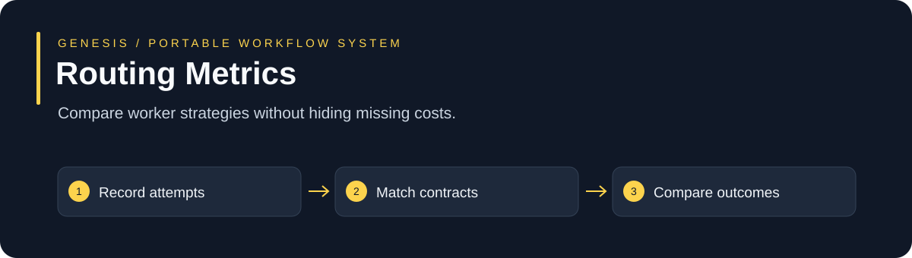

# Routing Metrics

Compare worker strategies without hiding missing costs.

**Node.js 20+ · Built-in modules only · MIT · No daemon or model account required**

[Why use it](#why-use-it) · [Quickstart](#quickstart) · [API and examples](#api-and-examples) · [Limits](#limits)

## Why use it

A cheap call can become expensive after retries or rework. Compare complete matched task histories and preserve unknown values.

Use it for: **Worker selection experiments, retry analysis and token-cost baselines.**

| A common starting point | This system adds | Why that helps |
| --- | --- | --- |
| Implicit assumptions and scattered state | An explicit, bounded input contract | You can inspect what was actually considered |
| A success flag | A structured result with gaps and failure cases | Missing evidence remains visible |
| A one-time example | Runnable positive and negative fixtures | You can test the behavior before adopting it |

This is a small library you integrate into your application. It is useful when this particular control is missing; it does not replace your existing agent, CI or business policy. These are design differences, not benchmark claims of superiority.

## Quickstart

```sh
git clone https://github.com/your-organization/genesis-routing-metrics.git
cd genesis-routing-metrics
npm test
npm run demo
```

No dependency installation is needed. Tests use temporary synthetic data and do not contact customers, charge payments or call model providers.

## API and examples

Exports: **analyzeRoutingMetrics**. See [the implementation](index.cjs), [runnable demo](examples/demo.cjs) and [complete input fixtures](test/index.test.cjs).

```js
const {analyzeRoutingMetrics}=require('..');
const observations=[{attemptId:'one',runId:'run-a',taskId:'task-a',taskType:'review',contractId:'checks-v1',contractVersion:'1',route:'worker-a',sequence:1,phase:'initial',status:'passed',historyComplete:false,latencyMs:120}];
console.log(JSON.stringify(analyzeRoutingMetrics(observations),null,2));
```

The tests document valid contracts, stale evidence, missing fields and failure behavior. Synthetic fixtures demonstrate mechanics; their values are not measured product-performance results. Use only authorized inputs in a real workflow.

## How it connects

1. **Record attempts.**
2. **Match contracts.**
3. **Compare outcomes.**

Use this module independently or find it in the [Genesis Suite](https://github.com/your-organization/genesis-suite). The suite connects planning, bounded workers, adaptation and evidence. Operational orchestration remains the responsibility of the host application.

## Limits

Caller-supplied observations need trustworthy collection. No automatic routing change, quality multiplier or universal savings claim is made.

Workflow memory and recorded lessons do not train model weights. No claim of doubled quality or 59–90% cost savings has been established by these fixtures. Paired accepted-task measurements are required before making a savings claim.

## Verification and contribution

Run `npm test` before proposing changes. Include a reproducer for a defect and preserve negative tests. GitHub Actions runs the same suite on Linux and Windows. The [MIT license](LICENSE) permits reuse and white-label adaptation; keep its copyright notice.
